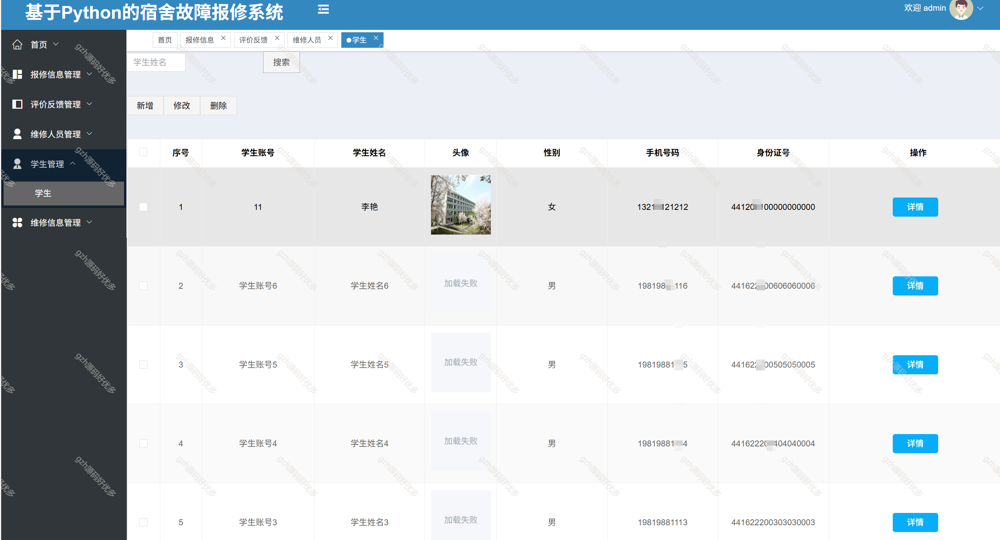

# python051
python051基于Python+Django的宿舍故障报修系统
 
## 查看主页获取源码

### 一、关键词
宿舍系统，宿舍故障报修系统

### 二、作品包含
源码+数据库+全套环境和工具资源+部署教程

### 三、项目技术
前端技术：Vue2.0、Element-ui
后端技术：Python3.7、Django2.0

### 四、运行环境（以下版本亲测，其他版本兼容性请自行测试）
开发工具：PyCharm + VSCODE

数据库：MySQL5.7（最低要5.7版本）

数据库管理工具：Navicat10+

Python：Python3.7

前端Nodejs：14

浏览器：谷歌浏览器

### 五、项目介绍
项目编号：python051

宿舍故障报修系统是为高校等宿舍场景设计，支持学生线上提交故障报修、跟踪处理进度，管理员统筹派工、管理流程及反馈评价，实现故障高效处理与宿舍运维数字化的平台 。

该基于 Python 的宿舍故障报修系统，管理员可在 “评价反馈管理” 模块，对学生提交的报修评价反馈进行搜索、修改、删除，以及查看详情、回复审核 。

### 六、运行截图

